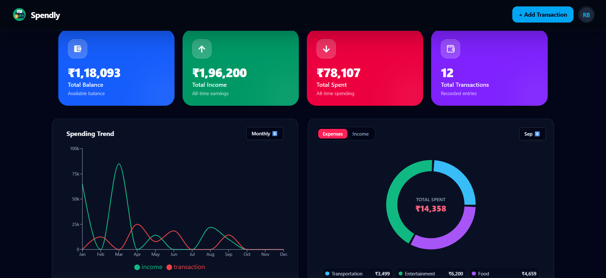
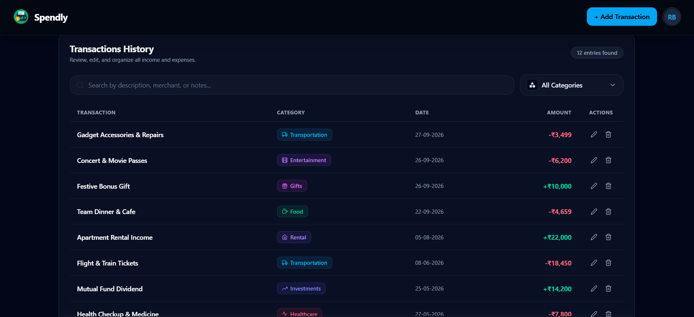

<div align="center">

# 💸 Spendly — Personal Expense & Wealth Tracker

A production-ready full-stack personal finance platform engineered to track cash flow, manage transaction ledgers, and deliver real-time visual spending analytics.

<!-- Tech Badges -->
<p align="center">
  
  
  
  
  
  
  
  
</p>

<!-- Live & Repo Action Buttons -->
<p align="center">
  <a href="https://spendly-expensetracker.onrender.com" target="_blank">
    
  </a>
  <a href="https://github.com/ranajitbera2006/Spendly-ExpenseTracker.git" target="_blank">
    
  </a>
</p>

</div>

---

## 🖼️ Application Preview

<table width="100%">
  <tr>
    <td width="50%" align="center"><b>Dashboard & Analytics View</b></td>
    <td width="50%" align="center"><b>Transaction Ledger View</b></td>
  </tr>
  <tr>
    <td></td>
    <td></td>
  </tr>
</table>

---

## ✨ Key Features

- 💳 **Real-Time Wealth Metrics:** Automated calculation of Total Available Balance, Gross Cumulative Earnings, Total Expenditures, and Ledger Entry count[cite: 3].
- 📈 **Dynamic Spending Trends:** Multi-axis interactive line and area visualizations illustrating income vs. spending trends over monthly and yearly intervals[cite: 3].
- 🍩 **Category Donut Breakdown:** High-resolution proportional expense and revenue allocation across categories (Transportation, Entertainment, Food, Shopping, etc.)[cite: 3].
- 📝 **Transaction Ledger:** Full record management with category badges, precise timestamps, Indian Rupee (`₹`) formatting, and inline action controls[cite: 1].
- 🛡️ **Hardened Backend Security:** Protected with HTTP-only cookie-based JWT sessions, password hashing (`bcryptjs`), request rate limiting (`express-rate-limit`), and secure HTTP headers (`helmet`).
- 🎨 **Modular Dark UI:** Styled with Tailwind CSS v4 and DaisyUI v5 components for responsive layouts across mobile, tablet, and widescreen setups.

---

## 🛠️ Tech Stack Breakdown

| Layer | Tools & Libraries |
| :--- | :--- |
| **Frontend Framework** | React 19, React Router DOM v7, Vite v8 |
| **State Management** | React Context API |
| **Styling & UI Kit** | Tailwind CSS v4 (`@tailwindcss/vite`), DaisyUI v5 |
| **Data Visualization** | Recharts v3 |
| **Backend & Runtime** | Node.js, Express 5 |
| **Database & ORM** | MongoDB, Mongoose v9 |
| **Security & Auth** | JSON Web Tokens (`jsonwebtoken`), `bcryptjs`, `cookie-parser`, `helmet`, `cors`, `express-rate-limit` |
| **Logging & Feedback** | Morgan HTTP logger, React Hot Toast, React Icons |

---

## 📁 Project Structure

```text
Spendly-ExpenseTracker/
├── backend/
│   ├── config/                      # Database & environment configurations
│   ├── controllers/                 # Auth & transaction route handler logic
│   ├── middleware/                  # JWT auth verification & rate limiters
│   ├── models/                      # User & Transaction Mongoose schemas
│   ├── routes/                      # Express endpoint definitions
│   ├── index.js                     # Server entry point & Express middleware setup
│   └── package.json
│
├── frontend/
│   ├── public/
│   │   ├── favicon.ico
│   │   ├── dashboardImg.png         # Screenshot of charts & metric cards
│   │   └── transactionImg.png       # Screenshot of transaction ledger
│   ├── src/
│   │   ├── components/
│   │   │   ├── component/           # Reusable widgets (Card, Button, Badge)
│   │   │   ├── hooks/               # Custom UI & lifecycle hooks
│   │   │   ├── layouts/             # Dashboard wrappers, Navbar, Shell
│   │   │   ├── pages/               # Top-level route views (Dashboard, Ledger)
│   │   │   └── parts/               # UI sections (Cards, Charts, Modals, Tables)
│   │   ├── context/                 # AuthContext & TransactionContext state stores
│   │   ├── App.jsx                  # Main routing & layout configuration
│   │   ├── main.jsx                 # Client entry point
│   │   └── index.css                # Tailwind CSS v4 theme directives
│   ├── package.json
│   └── vite.config.js
│
└── README.md